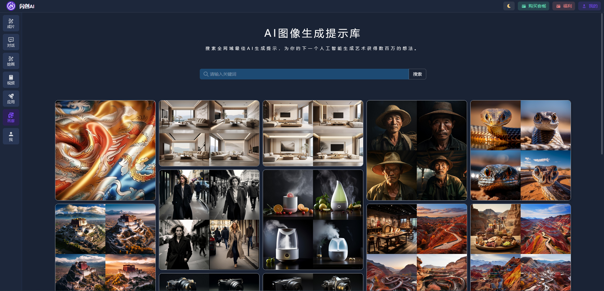
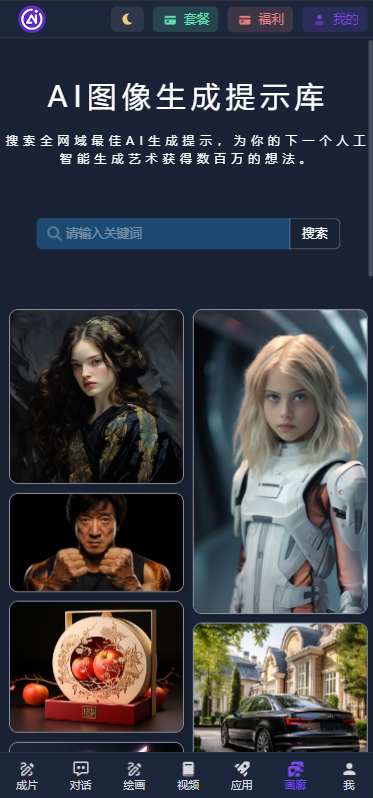

<h1 align="center">闪创 AI</h1>
个性化精美AI平台，支持三步成片功能，全开源免费使用！

## 📢 声明

- 本仓库为学习AI相关应用（包括GPT、文生图、图生视频等）的案例，仅用于测试和学习研究，禁止用于商业用途或任何非法用途。
- 任何用户直接或间接使用、传播本仓库内容时责任自负，本仓库的贡献者不对该等行为产生的任何后果负责。
- 如果相关方认为该项目的代码可能涉嫌侵犯其权利，请及时通知删除相关代码。

## 🔥 三步成片
- [x] 支持三步成片，只需三步即可生成不限时长的原创视频！

## 演示站点
- [👀 立即进入体验](https://www.jiuzhuayu.net/dialogue/index)

## 技术架构
- 前端：Vue3 + NaiveUI
- 后端：java
- 数据支持：MySQL8 + Redis

## 扫码获取
### 微信扫码
> 备注：AIGC咨询

### QQ扫码
> 备注：AIGC咨询

## 你需要准备
- 域名
- 服务器：最低1C1G（CPU 1核心 + 1G内存）即可支持
- 对话模型平台API密钥（可选，如果你要使用对话功能） 
- 绘画平台订阅账户（可选，如果你要使用绘画功能）
- 其他模块（依据自己想法开启与否决定是否准备）：例如短信、邮件、内容审核平台等等

## 特性功能
- [x] **极速部署，低内存高并发！**
- [x] **配置简单快捷，配置文件仅需数据库配置即可启动**
- [x] **强大的在线配置框架及丝滑版的体验！**
- [x] **完美的自适应，支持手机、平板、电脑等多种尺寸设备的浏览器在线访问！**
- [x] **ChatGPT + Azure OpenAI + 文心一言 + 自定义对话模型支持 + Pika
- [x] 🔥 **对话账号池（无限量）：支持OpenAI、文心一言、PIKA等**
- [x] 🔥 **对话多会话隔离支持、参数独立配置云端存储**
- [x] 🔥 **内容安全多层过滤：内置词库 -> 自定义词库 -> 第三方安全检测，可同时启用**
- [x] 🍃 **对话多模态支持：支持GPT-4-VISION的多模态支持，同时支持自定义对话模型开启多模态支持**
- [x] 🔥 **AI绘画支持：文生图、图生图、放大、微调、混图、咒语解析、平移、Seed值获取等众多功能**
- [x] 🍃 **Midjourney绘画支持：支持在绘画面板上对Midjourney绘画支持的参数调控和生成**
- [x] 🔥 **绘画账号池（无限量）：每个账号同时支持单独的并发线程设定，线程隔离。**
- [x] ✨ **绘图服务在线启动、重启、关闭 + 队列数量实时查看**
- [x] 👾 **绘图普通/快速模式区分，可单独设置扣除积分**
- [x] 👾 **视频生成：支持图生视频、文生视频功能，最长支持9秒**
- [x] 🔥 **视频账号池（无限量）：每个账号同时支持单独的并发线程设定，线程隔离。**
- [x] 绘画画廊：用户绘图公开展示（私有绘图不展示）
- [x] 应用市场：可后台管理动态添加及其他管理
- [x] **用户系统：邮箱 + 手机号码（登陆 / 注册 / 找回密码 / 修改密码 / 验证码登陆等等）**
- [x] **支付系统：微信（支持扫码支付+JSAPI支持） / 自定义外链**
- [x] **推广模块：支持用户推广分佣模式，分佣所获得的奖励可以兑换套餐。**
- [x] 套餐系统：支持每日周期重置与固定周期总量配置，满足不同需求。
- [x] 对话与积分消耗模式：提供多种Tokens消耗和单积分消耗模式，灵活多样。
- [x] 兑换码机制：便捷的兑换码系统，便于用户奖励的发放与管理。
- [x] 站点个性化定制：允许在线DIY主题色、LOGO、名称等，提供SEO优化、区块圆角调整、全局CSS自定义及流量统计功能。
- [x] 一体化后台管理：前台账户与后台管理系统紧密集成，一键管理，身份自动识别。
- [x] 绘画服务管理：支持在线启动、停止、重启绘画服务，实时查看任务状态和队列数量。
- [x] 邀请奖励机制：用户邀请好友获得奖励，内置防恶意自邀检测机制。
- [x] 全局模板自定义：提供注册、登录邮件模板、余额不足提醒、对话提示等全局模板的在线自定义功能。
- [x] 积分扣除自定义：对话模型和绘画操作支持单独设置积分扣除数量。
- [x] 用户侧边栏菜单控制：动态控制侧边栏菜单的显示与隐藏。
- [x] 用户端动态菜单：支持内嵌网页、外部链接和内部路径跳转，提供丰富的用户体验。
- [x] 对话记录导出：可将对话记录导出为PNG长图格式，便于保存和分享。
- [x] 游客访问支持：允许游客免登录访问界面，提高用户友好性。
- [x] 用户绑定要求：用户必须绑定手机或邮箱方可使用，增强账户安全性。
- [x] 敏感词过滤：提供敏感词去除开关和自定义正则支持，确保内容质量。

### PC端
#### 登陆授权

#### AI对话

#### AI对话-修改(深色模式)

#### AI绘画(深色模式)

#### AI绘画详情

#### AI对话-咒语描述(深色模式)

#### 应用(深色模式)

#### 应用使用(深色模式)

#### 画廊(深色模式)

#### 用户中心概览

#### 用户套餐(深色模式)

#### 邀请好友

### 移动端

#### 移动端 - AI绘画

#### 移动端 - 应用(深色模式)

#### 移动端 - 画廊

#### 移动端 - 我的

#### 移动端 - 登陆授权

